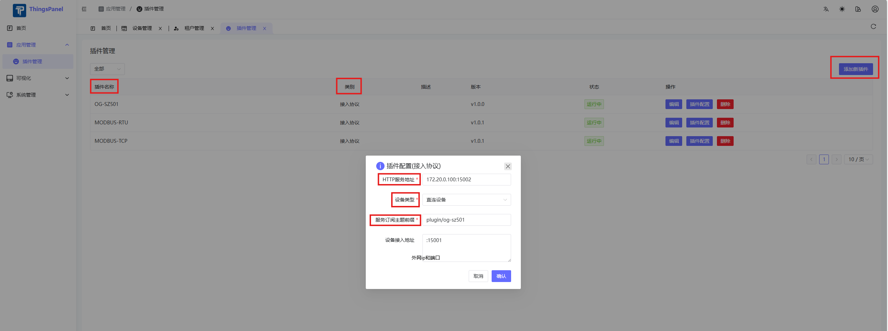

# Docker部署相关

## 打包镜像

镜像名称：protocol-plugin-og-sz501
版本号：1.0.0

```bash
docker build -t protocol-plugin-og-sz501:1.0.0 .
```

## 直接运行(如果使用的是官方docker compose方式部署，不推荐直接运行)

### 首次部署

更多配置请查看配置文件，规则如下（加前缀P_、大写、下划线分割）：

- P_PLATFORM_URL：平台地址
- P_PLATFORM_MQTT_BROKER：平台MQTT地址
- P_PLATFORM_MQTT_QOS：平台MQTT QOS
- P_LOG_LEVEL：日志级别

```bash
docker run -d --name protocol-plugin-og-sz501 -p 15001:15001 -p 15002:15002 -e P_PLATFORM_URL=http://127.0.0.1:9999 -e P_PLATFORM_MQTT_BROKER=127.0.0.1:1883 -e P_PLATFORM_MQTT_QOS=0 -e P_LOG_LEVEL=debug protocol-plugin-og-sz501:1.0.0
```

### 升级版本部署

```bash
# 升级脚本
#!/bin/bash
OLD_VERSION=${1:-1.0.0}
NEW_VERSION=${2:-1.0.1}

echo "Upgrading from $OLD_VERSION to $NEW_VERSION"

# 停止并删除旧容器
docker stop protocol-plugin-og-sz501
docker rm protocol-plugin-og-sz501

# 删除旧镜像（可选）
docker rmi protocol-plugin-og-sz501:$OLD_VERSION

# 启动新容器
docker run -d \
  --name protocol-plugin-og-sz501 \
  --network thingspanel_network \
  --ip 172.20.0.100 \
  -p 15001:15001 \
  -p 15002:15002 \
  -e TZ=Asia/Shanghai \
  -e P_PLATFORM_URL=http://backend:9999 \
  -e P_PLATFORM_MQTT_BROKER=gmqtt:1883 \
  -e P_PLATFORM_MQTT_QOS=0 \
  -e P_LOG_LEVEL=info \
  --restart unless-stopped \
  protocol-plugin-og-sz501:$NEW_VERSION

echo "Upgrade completed"
```

## 使用docker-compose运行(推荐)

使用项目根目录下的docker-compose.yml文件部署

### 首次部署

进入项目根目录，执行以下命令：

```bash
# 启动服务
docker-compose up -d

# 查看日志
docker-compose logs -f protocol-plugin-og-sz501

# 停止服务
docker-compose down
```

### 升级版本部署

```bash
# 方式一：完整重建（推荐）
docker-compose down
docker rmi protocol-plugin-og-sz501:1.0.0  # 可选，清理旧镜像
# 修改 docker-compose.yml 中的版本号为新版本
docker-compose up -d

# 方式二：强制重新创建
docker-compose up -d --force-recreate

# 方式三：滚动更新
docker-compose pull  # 如果镜像来自仓库
docker-compose up -d --no-deps protocol-plugin-og-sz501
```


## 平台WEB端配置


